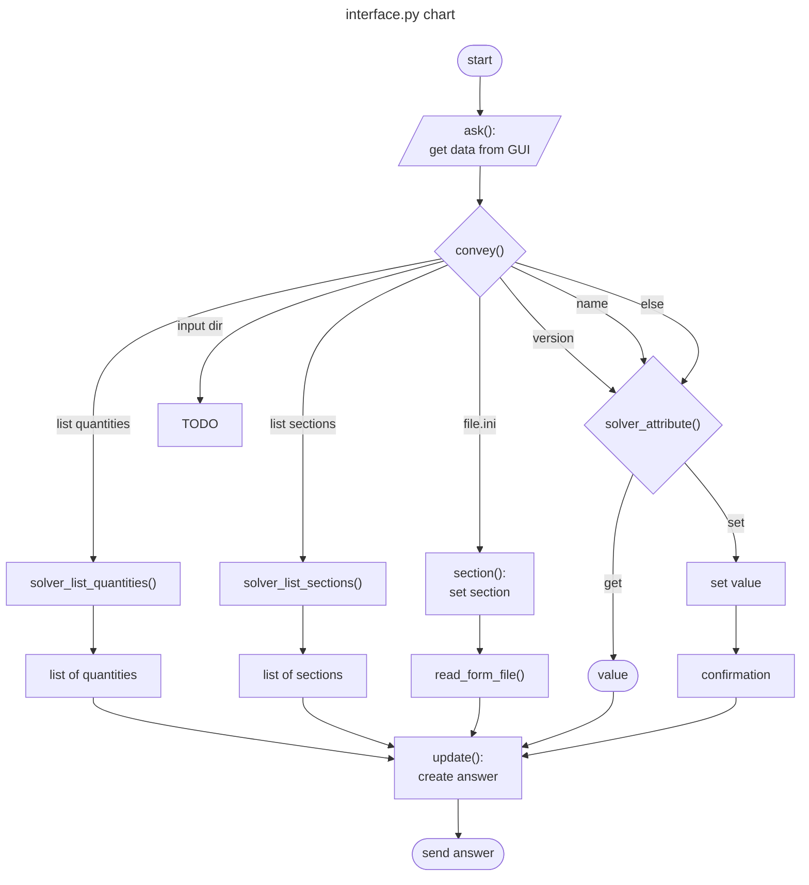

Explanation is discussion that clarifies and illuminates a 
particular topic. Explanation is understanding-oriented.

# Interface
Interface between GUI (at this time only kivy), and solver which
makes calculations. Thist interface separate GUI and solver.

## Data format

Python dictionary as input and output
example looks like:
```python
    {
        section: speaker,
        item: name,
        action: set,
        value: Visaton,
    }
```
where:  
- section: name of the solver module to work with  
- item: name of some value  
- action: set, get, answer, confirm, calculate, error  
- value: used for set, answer or error  
any additional value possible  
list of dictionaries are possible

## interface.py
file responsible for data change.
at this time only synchronously, but full asyn. in planned.


